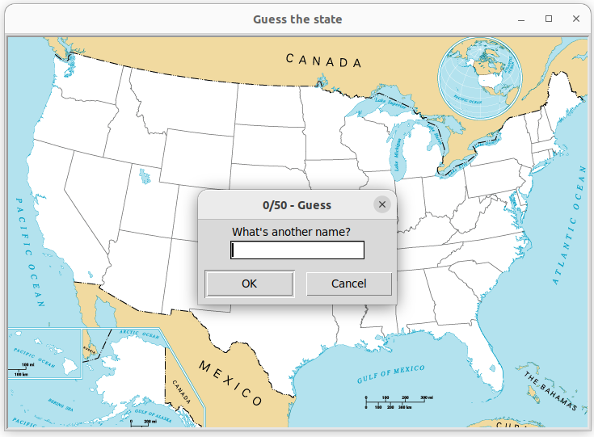

## U.S. States Game      

Try to guess all the 50 states in the U.S.       

Game written in Python using the Pandas and Turtle library.      

The program will write "you_missing.csv" file

Try to play [here](https://www.sporcle.com/games/g/states)            


###### It's a part of the **#100DaysOfCode** challenge by *Angela Yu*. ######    


#### Prerequisites
You will need the following software to run the U.S. States Game:
 - [Python 3](https://www.python.org/downloads/)
 - [Pandas](https://pandas.pydata.org/docs/getting_started/index.html)      
 
#### Installation
To get started with the **U.S. States Game**, follow these steps:


1. **Install** Pandas
```sh
pip install pandas
```       

2. **Clone** the repository:

```sh
git clone https://github.com/resole79/us_states_game.git
```

3. **Run** the **main.py** file:

```sh
python main.py
```

#### File Structure   
 - **main.py**: Main program.
 - **50_states.csv**: file to contain 50 U.S. states

#### **Usage**

Write "exit" to stop the game

Ask the user to input:
 - name of U.S. state



## **Credit**

Author : Emilio Reforgiato (resole79)

##
<p align="right"><a href="https://www.linkedin.com/in/emilio-reforgiato/" target=”_blank” ></a></p>


